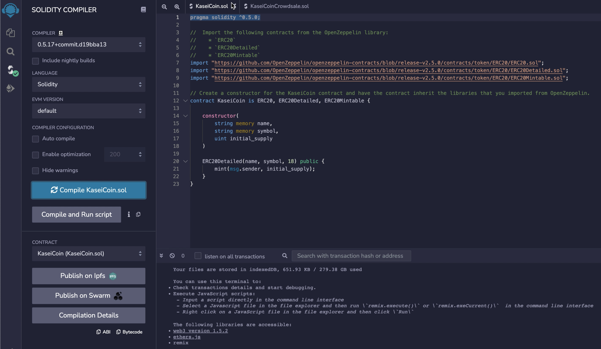

# Martian Token Crowdsale

Create a fungible token that is ERC-20 compliant and that will be minted by using a `Crowdsale` contract from the OpenZeppelin Solidity library.

The crowdsale contract that we create will manage the entire crowdsale process, allowing users to send ether to the contract and in return receive KAI, or KaseiCoin tokens. The contract will mint the tokens automatically and distribute them to buyers in one transaction.

---
### Language

| Component | Version |
|-----------|---------|
| Solidity  | 0.5.0   |
| Remix     | 0.23.3  |
| Ganache   | 2.5.4   |
| Metamask  | 10.14.0 |

---
### Operating System

This version of the software is operating system agnostic.

---
## Installation Guide

### Pre-requisites

- Remix web browser with Solidity 0.5.0

### Running the Crowdsale App

1. Compile `KaseiCoin.sol` and `KaseiCoinCrowdsale.sol` from Remix IDE.


2. Deploy the `KaseiCoinCrowdsale` from RemixIDE.


3. Create a new Ganache workspace for the project.


4. Add a new network to Metamask.


5. Connect Remix with Metamask and Ganache.


6. Deploy the contract.


7. View the deployed Contract.


8. View the transaction in Ganache.


9. Verify accounts to view the transferred Kasei coins.


10. Detailed demo is available in the following video:


---
## Contributors

```markdown
{
  "name": "Ashok Kumar Madhavi Selvaraj",
  "email": "ashok.ms.kumar@gmail.com",
  "linkedin": "https://www.linkedin.com/in/msashokkumar"
}
```
---

## License

Please refer to LICENSE.